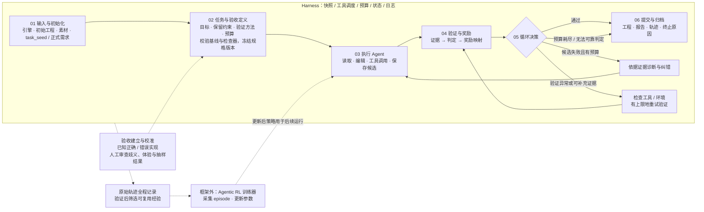

# 可验证游戏开发与修复框架

版本：v1.1 · 2026-09-20。设计草案，不代表相关组件已实现或已开展训练。

## 架构图

v1.1 调整布局：主流程从左向右；候选修复走上方，验证重试走下方；数据与训练接口单独成行。功能职责保持原设计。

- `architecture.html`：无需联网的浏览页面，支持适应窗口和原始尺寸切换。
- `architecture.svg`：可缩放矢量图，适合展示和导出。
- `architecture.png`：2700 × 1740 像素预览图，方便直接查看和分享。
- 本文件：阶段职责、接口约定与可编辑 Mermaid 源码。

## 六阶段流程

| 阶段 | 输入与动作 | 输出 |
|---|---|---|
| 1. 输入与初始化 | 固定引擎版本、初始工程、素材、任务种子/正式需求、运行配置与随机种子 | 可复现的任务实例与初始快照 |
| 2. 任务与验收定义 | 明确目标行为、保留约束、验证方法、预算；检查初始状态与验证器 | 版本化验收规格、检查器、基线结果 |
| 3. 执行 | Agent 读取、修改代码与场景，保存候选 | 候选工程及编辑/工具轨迹 |
| 4. 验证与奖励 | 运行检查并收集证据，判定后再映射奖励 | 分项 pass/fail/inconclusive、证据引用、reward、reward_valid |
| 5. 循环决策 | 根据判定、失败来源和剩余预算选择下一步 | 提交、候选修复、验证重试或结束 |
| 6. 提交与归档 | 保存选定工程、验证结果、轨迹及终止原因 | 带证据的交付与 episode 记录 |

Harness 覆盖整个生命周期，负责快照、工具调度、预算、状态流转、日志和异常管理。执行 Agent 负责修改与诊断，验证器负责证据和判定，奖励映射负责将有效判定转换为训练信号。

若 task_seed 只是粗略想法，在阶段 2 将其具体化为正式任务；若已经是完整需求，无需再设置任务扩写模块。

## 循环与边界

1. 候选工程失败：把失败证据交给 Agent，回到执行阶段修复。执行 Agent 不得修改验收程序或放宽标准。
2. 验证过程异常：先检查测试工具与运行环境。不能把工具故障直接当作候选质量的负奖励。
3. 无法判定：在预算内补充证据或重试；仍无法判定时结束并报告，需要时请求人工处理。
4. 通过或预算耗尽：进入提交归档；未通过也必须保留最终状态和终止原因，不能把结束标成成功。
5. 验收变更：修复沿用同一版规格。若发现检查器错误，保存修正原因及新版本，重新验证受影响候选。
6. 经验管理：原始成功/失败轨迹全程保存；只有有证据支持的经验进入可复用经验库。第一版可只实现原始轨迹归档。评测固定经验库并隔离测试信息。
7. 结果解释：真实跑圈成功仅证明相应测试条件下可通行；驾驶员失败不能单独证明赛道不可通行。超时如何判定应由测试规格明确。

## 验证器接口建议

```json
{
  "task_id": "racing-example",
  "candidate_id": "candidate-002",
  "contract_version": "v1",
  "verifier_version": "v1",
  "checks": [
    {
      "requirement_id": "vehicle_completes_lap",
      "status": "inconclusive",
      "reason": "驾驶员超时，尚不能区分驾驶策略与赛道问题",
      "evidence": ["lap.json", "telemetry.jsonl"]
    }
  ],
  "reward": null,
  "reward_valid": false
}
```

证据、判定和奖励分别保存，便于审查、奖励重算和故障排查。候选自身崩溃可构成有效失败；基础设施异常通常需要重试或排除反馈。应记录运行快照和验证版本，避免报告与被测工程不一致。

## RL 接口

一次任务运行构成一个 episode；模型动作包括文件编辑、工具调用和提交；观察包括工程内容、日志、运行状态及验证反馈。奖励来自有效判定。训练器位于 harness 外部，负责轨迹采集与参数更新；更新后的策略版本供后续 episode 使用。

第一版固定 harness，主要更新模型参数。同一运行协议可用于数据采集、训练 rollout 和固定策略评测；评测关闭参数更新，并固定模型、预算和可访问经验库。

## Mermaid 源码



## 第一版验收目标

选择一条任务，固定输入和验收规格，完成一次真实修改与验证；至少演示一次失败反馈如何返回执行阶段。最终能从归档中追溯需求、候选、证据和终止原因。验证错误路径可用明确标记的工具故障样例检查，不与真实候选失败混淆。
